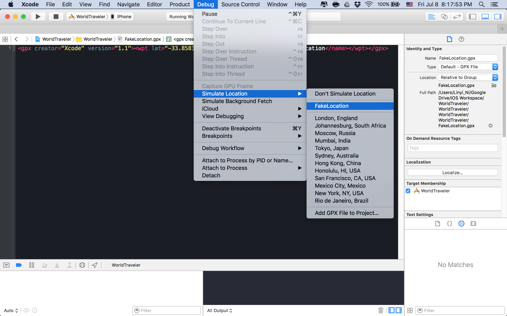
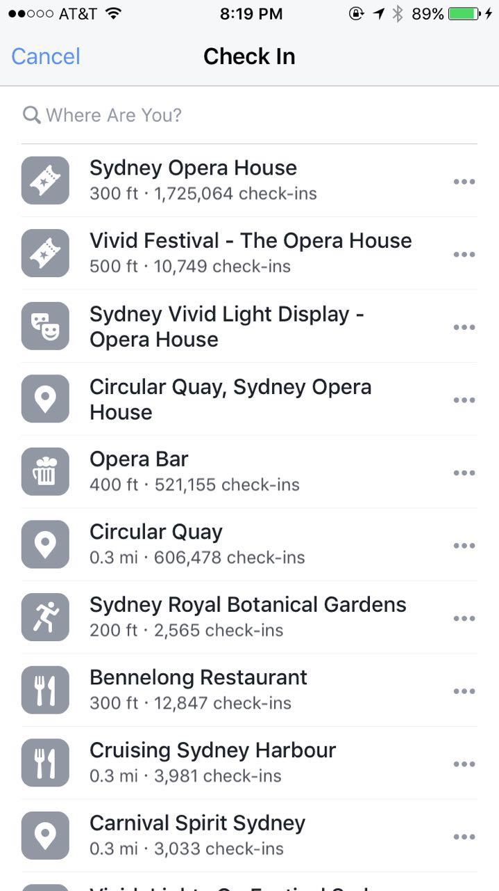
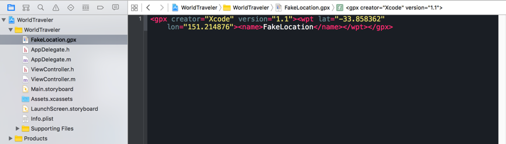
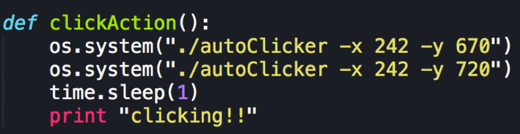

WorldTraveler
-------------
Forge a fake location in your iOS device.  
## Usage
**Firstly**, you need to have Xcode installed in your Mac.  
**Secondly**, open the project "WorldTraveler.xcodeproj".  
**Thirdly**, plug in your iOS device to computer and press Command+R to run your program(You might need to change the simulation target. Product -> Destination -> Your device). You need to make sure your iOS device is properly configured that it can accept the app installed from XCode. (General -> Profiles & Device Management -> Developer App -> Trust)  
**Finally**, change the location.  
  

  
  
   
Now! Don't plug out your device! Just press your home button and open a social media app like Facebook. You can see your location has been changed to Sydney Opera House!  
  

## Customize your location
Open FakeLocation.gpx in Xcode and change the value of "lat" and "lon" in this file. Save the file and do the last step above again.

## Reatin the location
In some circumstances, your location will be changed immediately by some other apps because the last step above just read the location file and change be the location for only once. Thus, you need a trick to keep your location! Here is the trick, I write a script to repeat the last step above by stimulating the mouse clicking. **And here is the most awesome feature**, if you do this, it means you are keeping reading your location file and keeping changing your location and if you write another program to manipulate this location file (listen your keyboard to change the lat and lon in the file?), you are technically moving! Image that you are using this trick in Pokemon.  
So, what you need to do is to find the two coordinates in your screen. You can easily pinpoint your coordinate by running "./autoClicker -x [gussedXCordinate] -y [gussedXCordinate]" in your terminal. For example, 
  

You can see your mouse will move immediately to the (242,670). After several trials, I think you can easily find the correct coordinates.  

Then, change the python code and run the script!   
   

##Warning
This program is just for fun. Do not use in Pokemon! 
